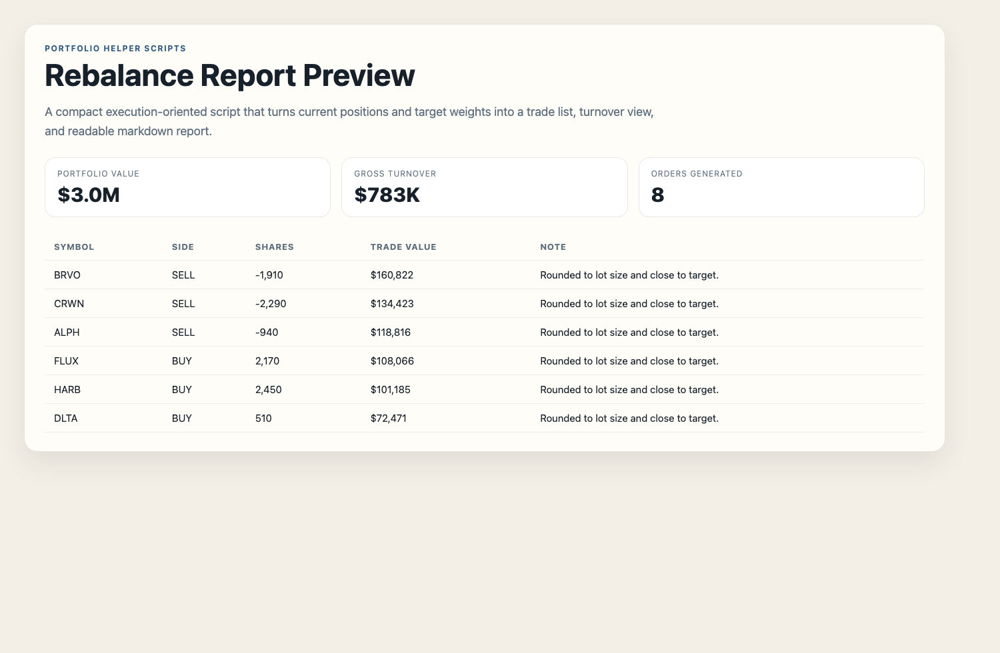

<div align="center">
  <h1>Portfolio Helper Scripts</h1>
  <p><strong>A compact utility project for generating rebalance orders, turnover checks, and a markdown rebalance report.</strong></p>
  <p>Built to show practical scripting and execution-oriented workflow automation.</p>
</div>

<p align="center">
  <code>python scripts</code>
  <code>portfolio workflow</code>
  <code>rebalance helper</code>
  <code>csv outputs</code>
  <code>markdown report</code>
</p>

## Portfolio Role

This is the smallest repo in the portfolio on purpose. It shows that the portfolio is not only made of big demos, but also includes practical tools that solve a concrete task cleanly.

## Preview



## What It Does

Given:

- a CSV of current positions
- a CSV of target portfolio weights

the script will:

1. calculate current portfolio weights
2. infer target dollar values from total portfolio value
3. round trade sizes to round lots
4. generate a buy / sell order list
5. produce a markdown rebalance report
6. run simple concentration and turnover checks

## Example Output

The script writes:

- `rebalance_summary.csv`
- `orders.csv`
- `region_view.csv`
- `checks.csv`
- `rebalance_report.md`

to the output folder you provide.

## Quick Start

```bash
python3 -m venv .venv
source .venv/bin/activate
pip install -r requirements.txt
python -m src.cli
```

## Project Structure

```text
portfolio-helper-scripts/
├── README.md
├── requirements.txt
├── data/
│   ├── current_positions.csv
│   └── target_allocations.csv
├── reports/
└── src/
    ├── __init__.py
    ├── cli.py
    ├── rebalance.py
    └── reporting.py
```

## Why This Project Is Useful In A Portfolio

This repo is small, but it tells a good story:

- you can turn a workflow into a script
- you can work with portfolio-style data
- you can build outputs that are usable, not just theoretical
- you can keep a project compact and still make it feel complete

## Notes

- The data in this repo is synthetic.
- The rebalance logic is intentionally lightweight and public-safe.
- The purpose is to show execution-oriented scripting, not proprietary portfolio construction logic.

## Screenshot Strategy

- use the generated `rebalance_report.md` as the main README visual if you want one
- optionally add a small snippet of `orders.csv`
- emphasize utility and execution, not interface design
